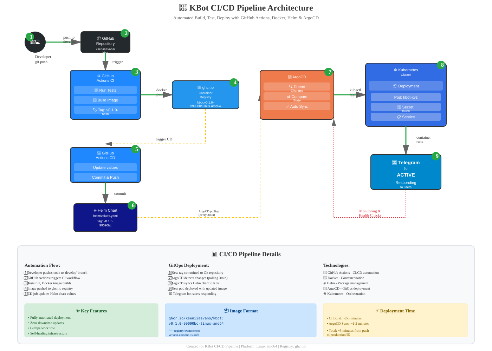

# 🤖 KBot - Automated Telegram Bot with Full CI/CD

> **Fully automated Telegram bot with CI/CD pipeline based on GitHub Actions, Docker, Helm, and ArgoCD**

---

## 📋 Table of Contents

- [About the Project](#-about-the-project)
- [CI/CD Architecture](#️-cicd-architecture)
- [Detailed Workflow](#-detailed-workflow)
- [Technologies](#-technologies)
- [Quick Start](#-quick-start)
- [Configuration](#-configuration)
- [Local Development](#-local-development)
- [Monitoring](#-monitoring-and-logs)
- [Troubleshooting](#-troubleshooting)
- [Contributing](#-contributing)

---

## 🎯 About the Project

KBot is a modern Telegram bot with a fully automated deployment process. The project demonstrates DevOps and GitOps best practices:

- ✅ **Automatic build** on every commit
- ✅ **Containerization** with multi-architecture support
- ✅ **GitOps deployment** via ArgoCD
- ✅ **Self-healing** infrastructure
- ✅ **Zero-downtime** updates

### 🎯 Key Features

| Feature | Description |
|---------|-------------|
| 🔄 **Auto-deployment** | Automatic deployment on push to `develop` |
| 🐳 **Container Registry** | Images published to `ghcr.io` |
| ⎈ **Helm Charts** | Declarative Kubernetes resource management |
| 🔍 **ArgoCD Sync** | Automatic cluster state synchronization |
| 📊 **Monitoring** | State visualization through ArgoCD UI |
| 🔐 **Secrets Management** | Secure token storage |

---

## 🏗️ CI/CD Architecture

### Complete Process Diagram



*The diagram demonstrates the interaction of all infrastructure components from git push to a running Telegram bot*


**CI Result:**
```
✅ Image: ghcr.io/kseniiaevans/kbot:v0.1.0-99090bc-linux-amd64
✅ Tests: Passed
✅ Build: Success
```

**CD Result:**
```
✅ Helm Chart: Updated
✅ ArgoCD: Synced
✅ Pod: Running
✅ Bot: Active
```

---

## 🚀 Quick Start

### Prerequisites

Before starting, ensure you have:

- ✅ Kubernetes cluster (minikube, kind, or production)
- ✅ `kubectl` CLI tool
- ✅ `helm` version 3+
- ✅ GitHub account with Personal Access Token
- ✅ Telegram Bot Token (obtained from @BotFather)

### Step 1: Clone Repository

```bash
git clone https://github.com/kseniiaevans/kbot.git
cd kbot
```

### Step 2: Install ArgoCD

```bash
# Create namespace
kubectl create namespace argocd

# Install ArgoCD
kubectl apply -n argocd -f https://raw.githubusercontent.com/argoproj/argo-cd/stable/manifests/install.yaml

# Wait for readiness
kubectl wait --for=condition=Ready pods --all -n argocd --timeout=300s
```

### Step 3: Access ArgoCD UI

```bash
# Get initial password
kubectl -n argocd get secret argocd-initial-admin-secret \
  -o jsonpath="{.data.password}" | base64 -d

# Port-forward
kubectl port-forward svc/argocd-server -n argocd 8080:443

# Open: https://localhost:8080
# Username: admin
# Password: <obtained above>
```

### Step 4: Create Secrets

```bash
# Telegram Bot Token
kubectl create secret generic telegram-token-secret \
  --from-literal=teleToken=YOUR_TELEGRAM_BOT_TOKEN

# GitHub Container Registry (for private repositories)
kubectl create secret docker-registry registry-secret \
  --docker-server=ghcr.io \
  --docker-username=YOUR_GITHUB_USERNAME \
  --docker-password=YOUR_GITHUB_TOKEN \
  --docker-email=YOUR_EMAIL
```

### Step 5: Deploy Application

```bash
# Apply ArgoCD Application
kubectl apply -f argocd/application.yaml

# Check status
kubectl get application -n argocd kbot

# Wait for sync
kubectl wait --for=condition=Synced \
  application/kbot -n argocd --timeout=300s
```

### Step 6: Verify Operation

```bash
# Check pod
kubectl get pods -l app.kubernetes.io/name=helm

# View logs
kubectl logs -l app.kubernetes.io/name=helm -f

# Expected output:
# 2024/12/13 12:00:00 Bot started successfully
# 2024/12/13 12:00:01 Listening for messages...
```

### Step 7: Test Bot

Open Telegram and message your bot:
```
/start
```

Expected response:
```
👋 Hello! I'm KBot. How can I help?
```

---

## 💻 Local Development

### Build Project

```bash
# Compile
make build

# Run tests
make test

# Run locally (requires TELE_TOKEN)
export TELE_TOKEN=your_telegram_token
./kbot
```

### Docker Development

```bash
# Build image locally
make image \
  TARGETARCH=amd64 \
  TARGETOS=linux

# Run container
docker run -it --rm \
  TARGETARCH=amd64 \
  TARGETOS=linux

# Push image
make push \
  TARGETARCH=amd64 \
  TARGETOS=linux
```

### Kubernetes Logs

```bash
# Real-time bot logs
kubectl logs -l app.kubernetes.io/name=helm -f

# Logs from last hour
kubectl logs -l app.kubernetes.io/name=helm --since=1h

# Logs from previous container (after crash)
kubectl logs -l app.kubernetes.io/name=helm --previous

# Detailed pod information
kubectl describe pod -l app.kubernetes.io/name=helm
```
